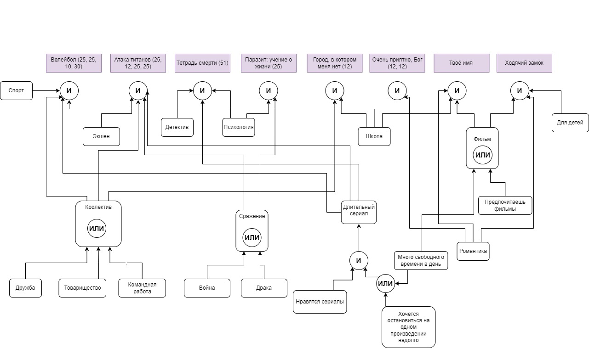

# Отчет по лабораторной работе
## по курсу "Искусственый интеллект"

### Студенты: 

| ФИО       | Роль в проекте                     | Оценка       |
|-----------|------------------------------------|--------------|
| Демина | Описала общую схему предметной области |          |
| Тумаков | Реализовал оболочку ЭС на python |       |
| Епанешников | Создание идеи. Тестирование |      |
| Айрапетова   | Объединение. Написание отчёта |          |

## Результат проверки

| Преподаватель     | Дата         |  Оценка       |
|-------------------|--------------|---------------|
| Сошников Д.В. |              |               |

> *Комментарии проверяющих (обратите внимание, что более подробные комментарии возможны непосредственно в репозитории по тексту программы)*

## Тема работы

Тема работы - подбор аниме для новичка. Программа должна из списка аниме, которые чаще всего рекомендуют для просмотра новичку, выбрать по предпочтениям пользователя. Экспертная система обращает внимание на возраст пользователя, предпочтения по жанрам, наличие у него свободного времени и т. п.

## Концептуализация предметной области

Опишите результаты концептуализации предметной области:
 - Выделенные понятия: жанр, сеттинг, хронометраж, возрастной рейтинг...
 - Тип получившейся онтологии: иерархия
 - Тип знаний: статистические
 - Как предметная область может быть разделена между участниками для коллективного создания базы знаний: 
 
  Предметная область была разделена таким образом, чтобы два эксперта по знаниям могли работать независимо друг от друга. Первый эксперт выделял жанры аниме и возможную иерархию групп лиц, которым они понравятся. Второй эксперт выделял характеристики этих самых групп лиц. Таким образом, оставалась одна маленькая деталь, связать характеристики групп лиц с самими группами.

Графическая иллюстрация:


## Принцип реализации системы

Мы решили использовать обратный вывод, так как более удобен и понятен для пользователя. Даже если подходящего аниме не окажется в нашей системе, отвечая на вопросы, пользователь сможет лучше понять, что конкретно он хочет посмотреть. Мы выбрали язык Python (с расширением PyKnow), потому что он нам хорошо знаком, а также у нас был подробный пример реализации экспертной системы с обратным выводом именно на этом языке.

## Механизм вывода

Мы узнаем интересы нашего пользователя и заносим их в список фактов о нем. В Pyknow заданы правила с помощью которых факты из списка проверяются и доказываются, а впоследствии добавляются в память. Это повторяется до тех пор пока мы не найдем интересующие нас утверждения. 

Правила в системе Pyknow 
```
class Anime(KnowledgeEngine):
    result = []

    @Rule(Fact('Нравятся сериалы'),
           OR(Fact('Хочется остановиться на одном произведении надолго'),Fact('Много свободного времени в день')))
    def long_series(self):
        self.declare(Fact('длительный сериал'))
        
    @Rule(OR(Fact('про дружбу'),Fact('про товарищество'),Fact('про командную работу')))
    def collective(self):
        self.declare(Fact('коллектив'))

    @Rule(OR(Fact('про драки'),Fact('про войну')))
    def battle(self):
        self.declare(Fact('сражение'))
    
    @Rule(OR(Fact('Предпочитаешь фильмы'),Fact('Много свободного времени в день')))
    def film(self):
        self.declare(Fact('фильм'))

    @Rule(Fact('спорт'),Fact('школа'),Fact('коллектив'),Fact('длительный сериал'))
    def voleyball(self):
        self.declare(Fact(anime='волейбол'))
        
    @Rule(Fact('экшен'),Fact('коллектив'),
          Fact('сражение'),
          Fact('длительный сериал'))
    def titans(self):
        self.declare(Fact(anime='атака титанов'))

    @Rule(Fact('длительный сериал'),
          Fact('психология'),
          Fact('детектив'))
    def deathnote(self):
        self.declare(Fact(anime='тетрадь смерти'))

    @Rule(Fact('психология'),
          Fact('сркажение'))
    def parasite(self):
        self.declare(Fact(anime='паразит: учение о жизни'))

    @Rule(Fact('коллектив'),
          Fact('школа'))
    def city(self):
        self.declare(Fact(anime='город в котором меня нет'))

    @Rule(Fact('нравится жанр романтика'))
    def god(self):
        self.declare(Fact(anime='очень приятно, бог'))

    @Rule(Fact('фильм'),
          Fact('нравится жанр романтика'),
          Fact('школа'))
    def yourname(self):
        self.declare(Fact(anime='твое имя'))

    @Rule(Fact('нравится жанр романтика'),
          Fact('фильм'),Fact('нужно детское аниме'))
    def castle(self):
        self.declare(Fact(anime='ходячий замок'))
        
    @Rule(Fact(anime=MATCH.a))
    def print_result(self,a):
        self.result.append(a)
        print('Аниме - {}'.format(a))
                    
    def factz(self,l):
        for x in l:
            self.declare(x)
```

## Извлечение знаний и база знаний

<!-- Опишите, как происходило извлечение знаний, с учётом совместной работы над проектом. Приведите фрагменты представления знаний: дерево И-ИЛИ, наиболее интересные правила.  -->

Извлечение знаний происходило на основе нашего личного опыта, а также некоторых общедоступных в интернете баз данных. Например, мы использовали сайт [Shikimori](https://shikimori.one/animes) и [MyAnimeList](https://myanimelist.net/).

## Протокол работы системы
**Пример 1:**


**Пример 2:**


## Выводы

Создание экспертной системы является полезным навыком в программировании. Он довольно прост относительно машинного обучения, которое зачастую используется для выполнения тех же задач, однако в каких-то случаях является достаточным и позволяет решать многие задачи. Экспертная система подразумевает логический подход и является, в какой-то степени, аналогом конструкции if-else. Задавая вопросы, ЭС приходит к выводу, который можно проследить по дереву вывода.

Благодаря данной лабораторной работе мы научились работать в команде, команду выбирали мы самостоятельно, поэтому было всем было комфортно работать друг с другом. Основное общение у нас было в discord. Нам очень понравилась наша концепция экспертной системы. Нам кажется она могла быть полезной для людей, которым трудно сделать выбор. Мы поняли, что не всегда нужно заниматься сложным машинным обучением, иногда можно воспользоваться достаточно несложной логикой экспертных систем.
